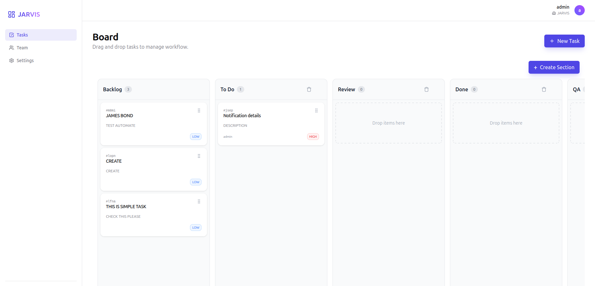

# 📋 TaskMaster - Modern Task Management Application

A powerful, intuitive, and secure task management solution built with Next.js 15, Prisma, and Tailwind CSS. Designed for teams to collaborate efficiently with a sleek, modern interface.



## ✨ Features

- **Kanban Board**: Drag-and-drop interface for managing tasks across customizable sections.
- **Role-Based Access Control (RBAC)**: 
  - **Admins**: Full control over users, settings, and board structure (create/delete/reorder sections).
  - **Users**: Manage tasks, view team members, and collaborate.
- **Team Management**: Invite members, assign roles, and manage access.
- **Secure Authentication**: JWT-based session management with secure password hashing.
- **Responsive Design**: Fully optimized for desktop and mobile devices.
- **Modern UI/UX**: Built with Tailwind CSS and Framer Motion for smooth interactions.

## 🛠️ Tech Stack

- **Framework**: [Next.js 15](https://nextjs.org/) (App Router)
- **Database**: [SQLite](https://www.sqlite.org/) (via Prisma ORM)
- **Styling**: [Tailwind CSS v4](https://tailwindcss.com/)
- **Authentication**: Custom JWT implementation with `jose` and `bcryptjs`
- **Drag & Drop**: [`@dnd-kit`](https://dndkit.com/)
- **Icons**: [Lucide React](https://lucide.dev/)

## 🚀 Getting Started

Follow these steps to set up the project locally.

### Prerequisites

- Node.js 18+ installed
- npm or yarn or pnpm

### Installation

1. **Clone the repository:**
   ```bash
   git clone https://github.com/yourusername/task-management.git
   cd task-management
   ```

2. **Install dependencies:**
   ```bash
   npm install
   ```

3. **Set up environment variables:**
   Create a `.env` file in the root directory and add the following:
   ```env
   # Database connection string (SQLite file)
   DATABASE_URL="file:./dev.db"

   # Secret key for JWT encryption (use a strong random string)
   JWT_SECRET="your-super-secret-key-change-this"
   ```

4. **Initialize the database:**
   Run the Prisma migration to create the database schema.
   ```bash
   npx prisma migrate dev --name init
   ```

5. **Start the development server:**
   ```bash
   npm run dev
   ```

6. **Access the application:**
   Open [http://localhost:3000](http://localhost:3000) in your browser.

## 📂 Project Structure

```
├── app/                  # Next.js App Router
│   ├── actions/          # Server Actions (Auth, Board, Users)
│   ├── api/              # API Routes
│   ├── components/       # Reusable UI Components
│   ├── dashboard/        # Dashboard Pages (Board, Settings, Users)
│   └── page.tsx          # Landing Page
├── lib/                  # Utilities (Auth, Prisma Client)
├── prisma/               # Database Schema
├── public/               # Static Assets
└── ...config files
```

## 🔐 Key Functionalities

### Authentication
- User Registration & Login
- Secure Session Management via HTTP-only Cookies
- Password Hashing with Bcrypt

### Board Management
- **Create Sections**: Admins can create new columns.
- **Reorder Sections**: Drag and drop columns to reorder.
- **Task Management**: Create, edit, delete, and move tasks between sections.

### User Roles
- **ADMIN**: Can manage team members, change user passwords, and configure board settings.
- **USER**: Can view and manage tasks assigned to them or their team.

## 🤝 Contributing

Contributions are welcome! Please fork the repository and submit a pull request for any enhancements or bug fixes.

1. Fork the Project
2. Create your Feature Branch (`git checkout -b feature/AmazingFeature`)
3. Commit your Changes (`git commit -m 'Add some AmazingFeature'`)
4. Push to the Branch (`git push origin feature/AmazingFeature`)
5. Open a Pull Request

## 📄 License

This project is licensed under the MIT License - see the [LICENSE](LICENSE) file for details.

---

Built with ❤️ by Simran Singh
